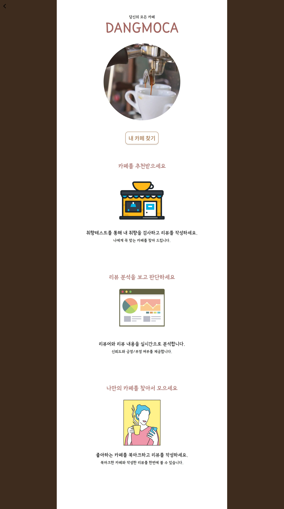
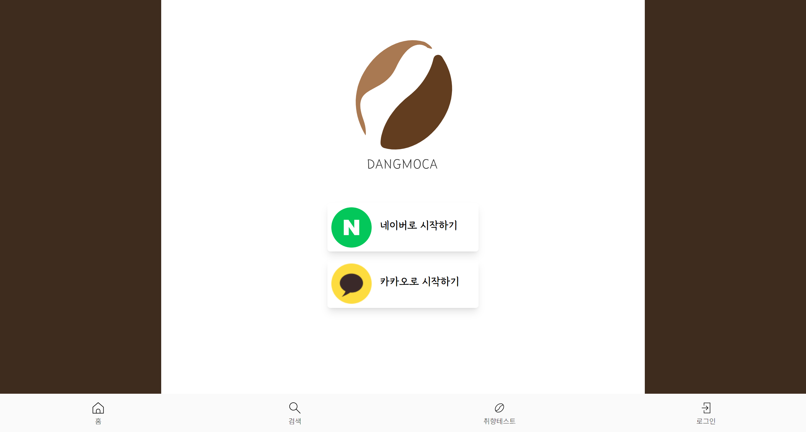
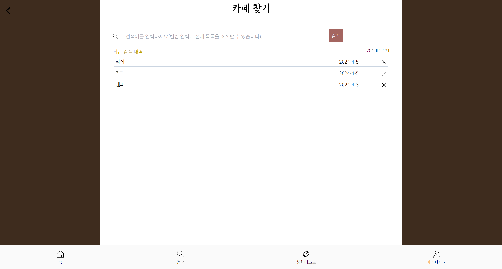
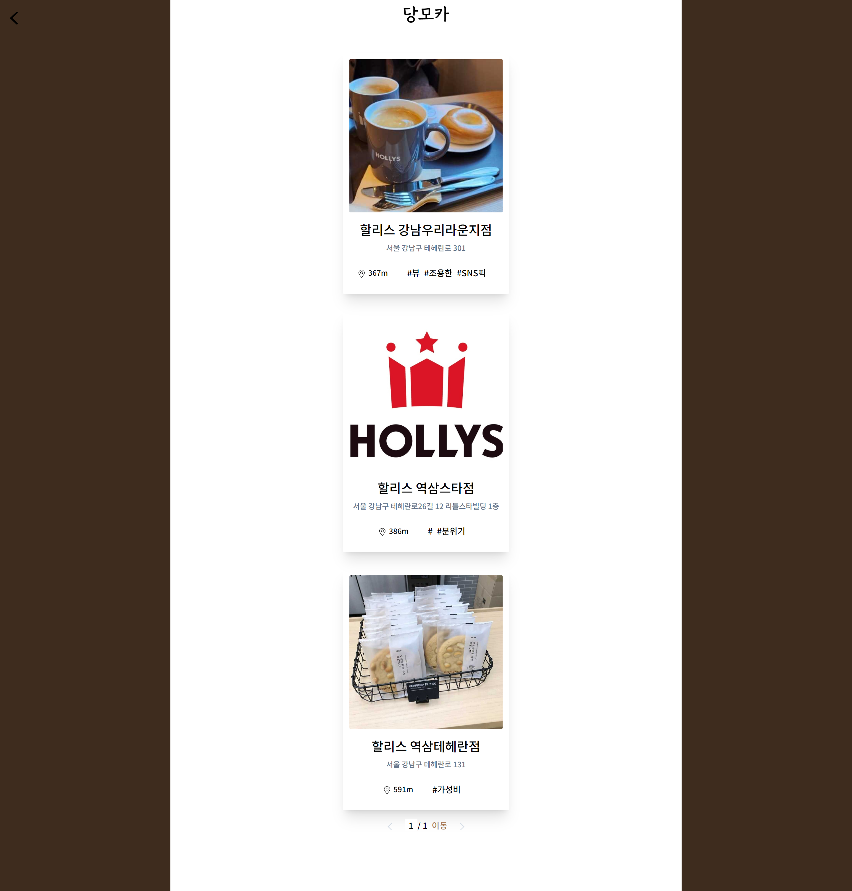
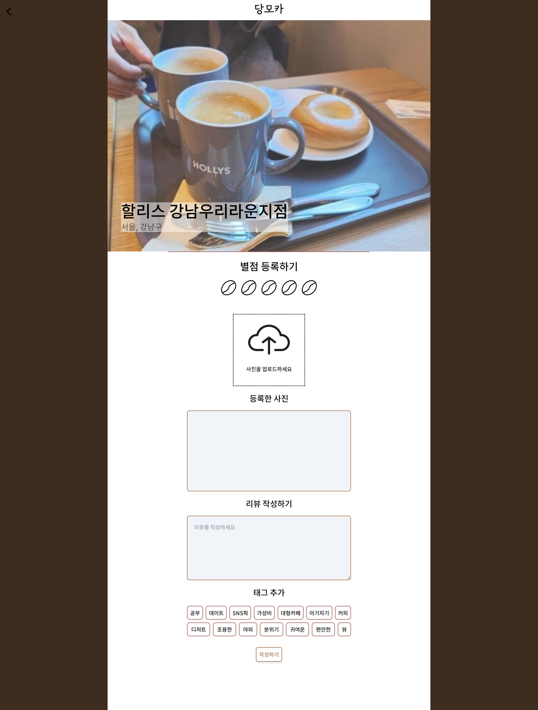
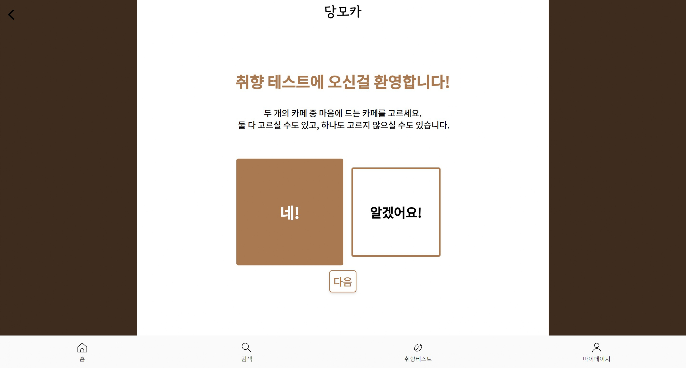
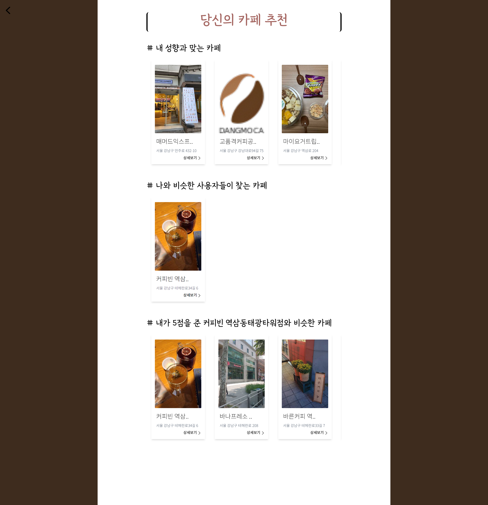
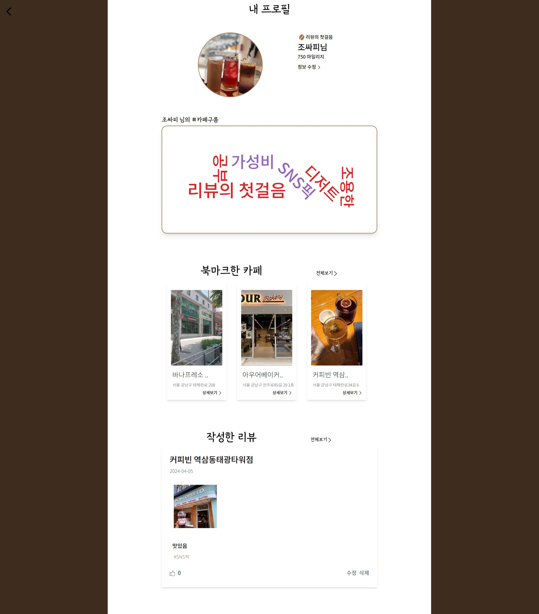

# 특화 프로젝트 당모카(DangMoCa) :coffee:


## 💡 UCC
https://www.youtube.com/watch?v=xqPXstnd1_g

## Member

| 팀원   |      역할       |
| :----- | :----------------: | 
| 지준호 | 데이터 |
| 김영진 | 인프라 |  
| 안수진 | FrontEnd | 
| 조용운 | FrontEnd | 
| 강민정 | Backend |  
| 김다나 | Backend | 

## 🚩 목차
1. 프로젝트 개요
2. 기술 스택
3. 서비스 소개
4. 기능 소개
5. 서비스 레이아웃
6. 기타 산출물


## 1. 프로젝트 개요 📑
### 서비스 소개
 - 여러 플랫폼에 산재 되어있는 리뷰를 통합하여 사용자에게 신뢰성 있는 카페 리뷰를 전달
 - 리뷰를 자연어 분석해서 감정과 신뢰도 분석 결과 제공
 - 개인 취향에 맞는 카페 추천

### 진행기간 
 - 2024.02.19 ~ 2024.04.04 (7주)

 ## 2. 기술 스택  🔨

- #### BackEnd


- #### FrontEnd


- #### Database


- #### Infra


   


####  Project Architecture


## 3. 기능 소개 💡

 #### 핵심 기능
 - 카페 검색 및 목록 조회
 - 카카오, 네이버, 자체 플랫폼 리뷰 통합 조회
 - 작성 리뷰의 감정, 신뢰도 분석 결과 제공
 - 취향테스트로 태그에 맞는 카페 추천

 #### 부가 기능
 - 사용자가 작성한 리뷰 경향에 따른 칭호 설정
 - 카페 북마크 목록

####  Apache Hive를 이용한 데이터 처리
- 크롤링 한 데이터를 HIVE를 이용하여 통합
- 위경도 값, 카페 이름, 전화번호 등을 기준으로 카페 정보 통합


####  KoBERT를 이용한 광고 리뷰 판별
```text
리뷰에서 나타날 수 있는 감정을 [최악, 별로, 중립, 괜찮음, 완전 좋음] 5가지로 나누고, 
KoBERT 모델을 이용하여 리뷰를 분석한 뒤 각 감정과 일치하는 정도를 수치로 나타내었다.
별점 5점과 "완전 좋음"의 감정 일치도가 90.0%가 넘는다면 광고 리뷰의 가능성을 제기하였다.

```

<!-- ####  칭호 부여
- 별점을 준 개수에 따라 적절한 칭호 부여

| 별점 \ 리뷰 개수 | 10 | 20 | 30 |
| :----- | :----------------: | :----------------: | :----------------: | 
| 1 | 깐깐한 커피콩 | 무덤덤한 커피콩 | 행복한 커피콩 |
| 3 | 깐깐한 커피열매 | 무덤덤한 커피열매 | 행복한 커피열매 |
| 5 | 깐깐한 커피원두 | 무덤덤한 커피원두 | 행복한 커피원두 | -->

####  카페 추천
- 사용자와 유사한 태그의 카페를 거리 순으로 최대 5개 추천
- 사용자가 5점을 준 카페와 비슷한 카페 5개 추천
- 선호 태그가 동일한 다른 사용자가 5점을 준 카페를 최대 5개 추천

## 5. 서비스 레이아웃 :page_facing_up:

### 메인 화면

### 소셜 로그인

### 카페 검색

### 카페 목록

### 카페 상세정보

### 리뷰 목록

### 리뷰 작성

### 취향테스트

### 추천 카페 목록

### 마이페이지



## 6. 기타 산출물
[기능 명세서](https://glaze-torta-a5b.notion.site/e69f07c5d5c94f8cafab8b5e6bc19492?pvs=74)

[API 명세서](https://glaze-torta-a5b.notion.site/API-05d4a20859d345bbb799a390e315ecc5)

[Convention](https://glaze-torta-a5b.notion.site/5cc47c3b9af341bea2659afb576e3202)
