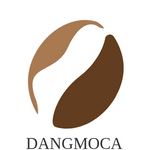
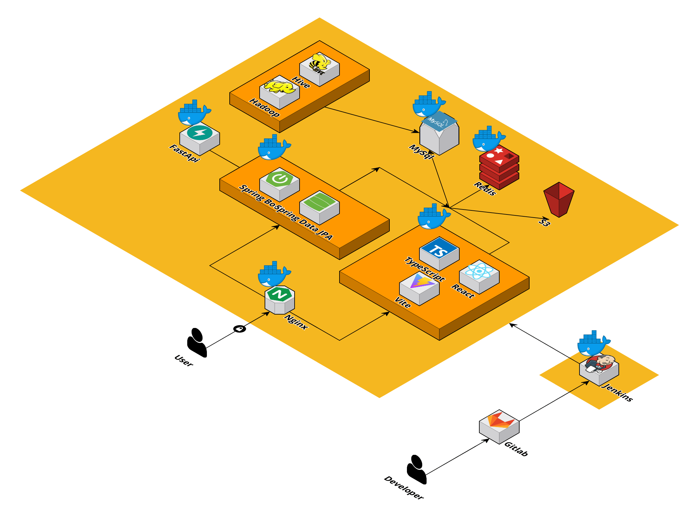

# 당모카 (당신의 모든 카페)

## 카페 리뷰 통합 서비스
- 여러 플랫폼의 카페 정보와 리뷰 통합 분석 사이트
- 사용자 리뷰 분석으로 리뷰의 감정 및 신뢰성 분석
- 사용자의 선호 태그 등에 따른 카페 추천
- 사용자 리뷰에 근거한 성향 분석으로 칭호 시스템

## 💡 UCC
https://www.youtube.com/watch?v=xqPXstnd1_g

## Member

| 팀원   |      역할       |
| :----- | :----------------: | 
| 지준호 | 데이터 |
| 김영진 | 인프라 |  
| 안수진 | FrontEnd | 
| 조용운 | FrontEnd | 
| 강민정 | Backend |  
| 김다나 | Backend | 

## 🚩 목차
1. 프로젝트 개요
2. 서비스 소개
3. 기능 소개
4. 시연
5. 기술 스택
6. 기타 산출물

## 📑 프로젝트 개요
#### 개요
 - 여러 플랫폼에 산재 되어있는 리뷰를 통합하여 사용자에게 신뢰성 있는 카페 리뷰를 전달
 - 리뷰의 신뢰성을 판단하여 사용자가 믿을만한 리뷰를 참고하여 의미 있는 소비를 할 수 있게 함
 - 개인 취향에 맞는 카페 추천해주는 사용자 맞춤형 서비스

#### 진행기간 
 - 2024.02.19 ~ 2024.04.04 (7주)

#### 🧮 서비스 소개
- 사용자 맞춤형 통합 리뷰 분석 및 카페 추천 플랫폼
- 네이버/카카오 지도 기반의 카페 정보, 메뉴, 리뷰를 통합하여 제공
- 사용자가 느낀 카페의 특징을 한눈에 보여주어 리뷰를 보지 않더라도 특징을 알 수 있게 함
- 사용자와 작성한 리뷰를 분석하여 신뢰도를 보여줌으로써 가짜 리뷰 방지
- 사용자를 분석하여 적절한 카페 추천

 ## 기술 스택

- #### BackEnd

- #### FrontEnd

- #### Database

- #### Infra

  

####  Project Architecture

## 💡 기능 소개
####  1. Apache Hive를 이용한 데이터 처리
- 크롤링 한 데이터를 HIVE를 이용하여 통합
- 위경도 값, 카페 이름, 전화번호 등을 기준으로 카페 정보 통합

####  2. KoBERT를 이용한 광고 리뷰 판별
- ~~~~~

####  3. 사용자 분석
- ~~~~

####  4. 칭호 부여
- 별점을 준 개수에 따라 적절한 칭호 부여

| 별점 \ 리뷰 개수 | 10 | 20 | 30 |
| :----- | :----------------: | :----------------: | :----------------: | 
| 1 | 깐깐한 커피콩 | 무덤덤한 커피콩 | 행복한 커피콩 |
| 3 | 깐깐한 커피열매 | 무덤덤한 커피열매 | 행복한 커피열매 |
| 5 | 깐깐한 커피원두 | 무덤덤한 커피원두 | 행복한 커피원두 |

####  5. 카페 추천
- 사용자와 유사한 태그의 카페를 거리 순으로 최대 5개 추천
- 사용자가 5점을 준 카페와 비슷한 카페 5개 추천
- 선호 태그가 동일한 다른 사용자가 5점을 준 카페를 최대 5개 추천

## 기타 산출물
[기능 명세서](https://glaze-torta-a5b.notion.site/e69f07c5d5c94f8cafab8b5e6bc19492?pvs=74)

[API 명세서](https://glaze-torta-a5b.notion.site/API-05d4a20859d345bbb799a390e315ecc5)

[Convention](https://glaze-torta-a5b.notion.site/5cc47c3b9af341bea2659afb576e3202)
